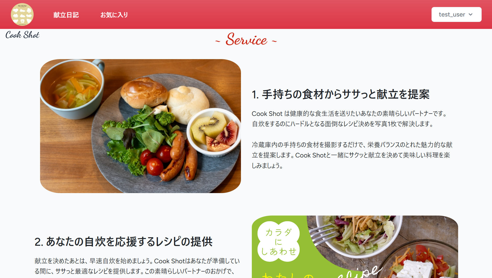

# 自炊パートナーアプリ Cook Shot



## 初回セットアップ

```sh 

cp .env.example .env

docker run --rm \
    -u "$(id -u):$(id -g)" \
    -v "$(pwd):/var/www/html" \
    -w /var/www/html \
    laravelsail/php82-composer:latest \
    composer install

docker-compose up -d
docker-compose exec laravel.test php artisan key:generate
docker-compose exec laravel.test php artisan migrate:fresh
docker-compose exec laravel.test npm install
docker-compose exec laravel.test npm run dev
```

## 2回目以降の起動

```sh
docker-compose up -d
docker-compose exec laravel.test npm run dev
```

## アプリケーションの停止

```sh
docker-compose stop
```


## Command Reference

```sh
# login to MYSQL console
docker-compose exec mysql mysql -u sail -p'password' example_app

# delete cashe
docker-compose exec laravel.test php artisan cache:clear
docker-compose exec laravel.test php artisan config:clear
docker-compose exec laravel.test php artisan route:clear
docker-compose exec laravel.test php artisan view:clear
docker-compose exec laravel.test php artisan clear-compiled

# Laravel実行コンテナにログイン
docker-compose exec laravel.test /bin/bash
```
